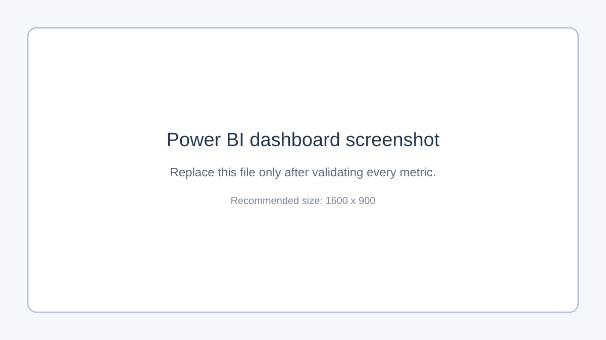

# Consumer Finance Complaint Intelligence

[](https://github.com/YOUR_USERNAME/consumer-complaint-intelligence/actions/workflows/ci.yml)

An end-to-end analytics project that ingests public Consumer Financial Protection Bureau complaint data, validates and models it with Python and SQL, and produces decision-ready datasets for Power BI.

> Portfolio status: replace this line with `Complete - live run YYYY-MM-DD` only after the full pipeline and dashboard work.

## Business questions

1. How are complaint volume, timely response, dispute, and relief rates changing?
2. Which product-issue combinations drive the largest volumes?
3. Which companies differ from the overall timely-response baseline?
4. Can fields known at receipt help explain response timeliness?

## Quick start

```bash
python -m venv .venv
# Windows: .venv\Scripts\activate
# macOS/Linux: source .venv/bin/activate
pip install -r requirements.txt
pytest -q
python -m src.pipeline --sample
```

Run a current public-data slice:

```bash
python -m src.pipeline --limit 5000 --start-date 2024-01-01
```

The public API is paginated and rate-limited, so a 5,000-row run can take several minutes. Start with `--limit 250` to verify the connection.

Outputs are written to `artifacts/`; processed detail data and the local database are written to `data/processed/`. These generated files are ignored by Git.

## Architecture

See [architecture and design decisions](docs/architecture.md). The flow is CFPB API -> Python validation -> Parquet/DuckDB -> SQL KPI models + interpretable model -> Power BI.

## Repository map

```text
src/                 ingestion, cleaning, database, model, CLI
sql/models.sql       documented KPI and ranking views
tests/               transformation tests and edge cases
docs/                architecture and Power BI instructions
data/sample/         tiny non-production fixture for reproducibility
.github/workflows/   automated lint, tests, and sample build
```

## Results

Replace this section after the live run. Include exact evidence, for example:

- Analyzed **[REAL ROW COUNT]** complaints received from **[MIN DATE]** to **[MAX DATE]**.
- All **[N]** documented data-quality checks passed.
- The largest product-issue combination was **[VALUE]**, representing **[VALUE]%** of the selected slice.
- The chronological holdout model achieved ROC-AUC **[VALUE]**; interpret this as predictive association, not causal effect.
- Decision recommendation: **[one specific, evidence-backed action]**.



## Data source and ethics

Source: [CFPB Consumer Complaint Database](https://www.consumerfinance.gov/data-research/consumer-complaints/). Complaint narratives and company responses have limitations; the CFPB does not verify every consumer account. Complaint counts are affected by company size, market share, product mix, reporting behavior, and taxonomy changes. This project does not rank company quality or make causal claims.

The current API may not populate the historical consumer-dispute field. Unknown values remain null rather than being treated as "No"; report that metric only when the selected data contains labeled records.

## Testing and reproducibility

- `pytest` covers required fields, duplicate handling, and engineered features.
- `ruff` checks Python quality.
- GitHub Actions runs linting, tests, and an offline sample pipeline on pushes and pull requests.
- The sample fixture makes CI independent of API availability.

## Next steps

- Add market-share denominators before comparing complaint incidence.
- Add a PostgreSQL deployment and indexes for multi-user serving.
- Add drift monitoring for product and issue distributions.
- Publish the Power BI report or a 3-5 minute walkthrough video.

## Author

Rishi Ratnakar - [LinkedIn](https://www.linkedin.com/in/rishi-ratnakar) | [GitHub](https://github.com/RishiRatnakarData)
