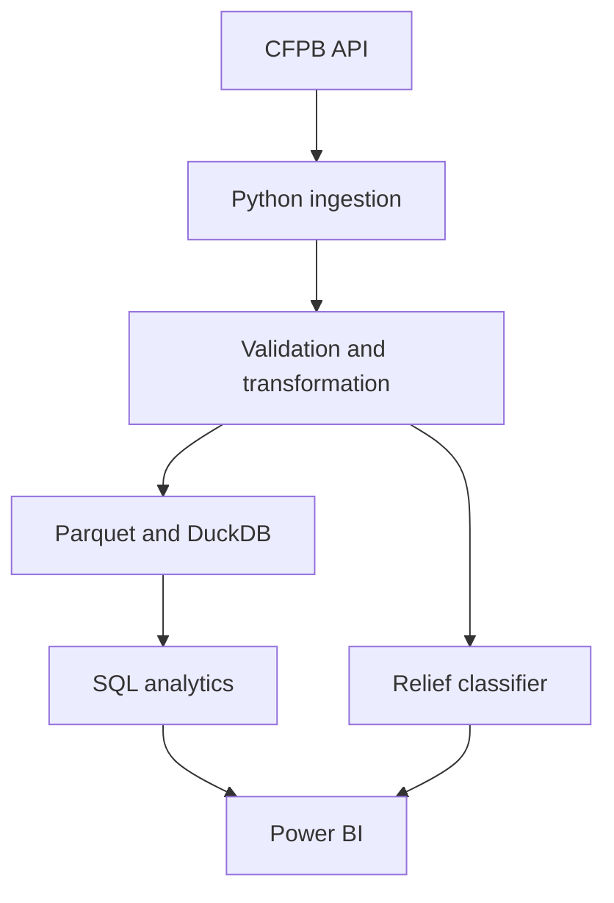

# Consumer Finance Complaint Intelligence

[](https://github.com/RishiRatnakarData/consumer-complaint-intelligence/actions/workflows/ci.yml)

An end-to-end analytics system for CFPB consumer complaints. It combines API ingestion, validated analytical datasets, DuckDB and SQL models, a leakage-aware classifier, automated testing, and a three-page Power BI report.


## Business problem

Millions of complaint records are difficult to interpret in raw form. This project turns them into reproducible metrics that help analysts understand complaint volume, product issues, company response patterns, and cases that may require additional review.

It answers four questions:

- How did complaint volume change during 2025?
- Which products and issues dominated the detail sample?
- How did sampled response outcomes vary among companies?
- Can intake-time information help identify complaints likely to receive relief?

## Key results

- The CFPB recorded **5,442,964 complaints in 2025**.
- Monthly volume rose from **335,236 in February** to **519,786 in October**, a **55.1% increase**.
- Credit reporting accounted for **4,379 of 5,000 sampled complaints (87.6%)**.
- "Incorrect information on your report" represented **58.2%** of sampled credit-reporting complaints.
- The sampled relief rate was **40.6%**, and **99.6%** of sampled complaints received a timely response.
- All **5 data-quality checks** passed.

Company-level relief rates in the sample varied substantially: TransUnion **63.3%**, Equifax **63.2%**, and Experian **0.7%**. These values are descriptive and are not company-quality rankings because they are not normalized for market share, customer exposure, or product mix.

## Architecture



The pipeline keeps full-population monthly totals separate from a 5,000-record weekly-stratified detail sample. This prevents sample counts from being presented as population totals. See [architecture and design decisions](docs/architecture.md).

## Technical implementation

- **Ingestion:** cursor-based CFPB API pagination with retries, date filters, progress reporting, and duplicate-page protection.
- **Transformation:** schema normalization, type conversion, duplicate removal, feature engineering, and five data-quality checks.
- **Storage and SQL:** typed Parquet outputs, a local DuckDB database, and SQL views for KPIs, company comparisons, and issue rankings.
- **Sampling:** weekly time windows distribute the detail sample across the full year.
- **Machine learning:** logistic regression uses only intake-time fields and a chronological 75/25 train-test split.
- **Automation:** GitHub Actions runs Ruff, pytest, and the offline sample pipeline on every push and pull request.

## Machine-learning evaluation

The classifier estimates whether a complaint will receive monetary or non-monetary relief. Outcome fields, company response, and timely-response status are excluded from predictors to prevent leakage.

| Metric | Result |
|---|---:|
| Training rows | 3,750 |
| Test rows | 1,250 |
| Baseline accuracy | 65.92% |
| Accuracy | 67.68% |
| Balanced accuracy | 73.61% |
| ROC-AUC | 73.30% |
| Average precision | 48.19% |
| Precision | 51.44% |
| Recall | 92.25% |
| F1 score | 66.05% |

The model emphasizes recall and identifies most sampled relief cases, but it also produces false positives. It is an analytical prioritization model, not an automated decision system or causal model.

## Power BI report

| Page | Purpose |
|---|---|
| [Executive Overview](docs/images/dashboard_overview.png) | Full-population monthly volume and sampled response outcomes |
| [Company Benchmark](docs/images/company_benchmark.png) | Descriptive company-level complaint, relief, and narrative comparisons |
| [Product & Issue Detail](docs/images/product_issue_detail.png) | Interactive product filtering and ranked issue analysis |

The semantic model and measures are documented in [docs/power_bi.md](docs/power_bi.md).

## Run locally

```powershell
py -3.12 -m venv .venv
.\.venv\Scripts\Activate.ps1
python -m pip install --upgrade pip
pip install -r requirements.txt
python -m pytest -q
python -m ruff check .
python -m src.pipeline --sample
```

Run the 2025 live-data build:

```powershell
python -m src.pipeline --limit 5000 --start-date 2025-01-01 --end-date 2025-12-31
```

Generated analytical files are written to `artifacts/`; processed Parquet data and the DuckDB database are written to `data/processed/`. Generated outputs are ignored by Git and can be reproduced from these commands.

## Testing and CI

- **9 automated tests** cover transformation, duplicate handling, cursor pagination, weekly sampling, monthly trends, and model behavior.
- Ruff enforces Python code quality.
- CI uses the committed sample fixture and does not depend on live CFPB availability.
- Secrets, generated data, local databases, virtual environments, and Power BI files are excluded from Git.

## Repository structure

```text
src/                 ingestion, transformation, analytics, and modeling
sql/                 DuckDB analytical views
tests/               automated unit and behavior tests
docs/                architecture and Power BI documentation
data/sample/         deterministic offline fixture for CI
.github/workflows/   continuous-integration workflow
```

## Limitations

- The 5,000 detail records are a systematic weekly-stratified sample, not a random probability sample.
- Raw company counts do not account for company size, market share, customer exposure, or product mix.
- Complaints reflect consumer submissions and are not independently verified findings of wrongdoing.
- Predictive associations do not establish causality, and model calibration may drift over time.

## Technology

Python, pandas, Requests, DuckDB, SQL, scikit-learn, Parquet, Power BI, pytest, Ruff, GitHub Actions

## Data source

[CFPB Consumer Complaint Database](https://www.consumerfinance.gov/data-research/consumer-complaints/)

## Author

Rishi Ratnakar | [LinkedIn](https://www.linkedin.com/in/rishi-ratnakar) | [GitHub](https://github.com/RishiRatnakarData)
