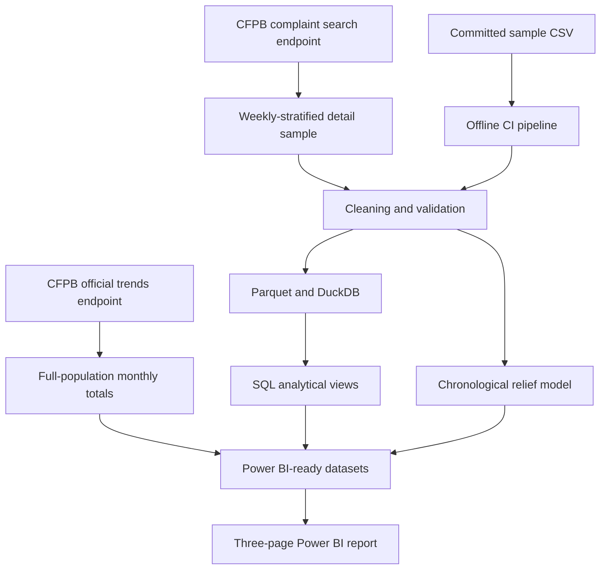

# Architecture and design decisions

## System flow



## Data architecture

The project deliberately separates two datasets with different analytical purposes.

### Official monthly population totals

The CFPB trends endpoint provides full-population monthly complaint counts. The validated 2025 series contains 12 months and 5,442,964 complaints.

This dataset supports population-level complaint-volume trends. It is written to:

```text
artifacts/official_monthly_counts.csv
```

### Weekly-stratified detail sample

The CFPB complaint search endpoint provides complaint-level records. The pipeline divides the requested period into weekly windows and distributes the requested sample size across those windows.

The validated live run contains 5,000 records spanning January through December 2025. Within each weekly window, the API returns the latest available records. The resulting dataset is therefore a systematic time-stratified sample, not a simple random probability sample.

This sample supports:

- Data-quality validation
- Product and issue analysis
- Descriptive company comparisons
- Response and relief analysis
- Predictive modeling

Sample counts are not presented as full-population company or product totals.

## Ingestion

`src/ingest.py` retrieves complaint-level records with cursor-based pagination using the API-provided `search_after` value. The implementation includes:

- Explicit start and end dates
- Bounded page sizes
- Retry handling
- Progress reporting
- Duplicate-page protection
- Requested-row limits

`src/trends.py` retrieves official monthly population counts separately from the complaint-detail search results.

`src/sampling.py` constructs the weekly windows and allocates the requested number of detail records across them.

## Transformation and quality checks

`src/transform.py` standardizes column names and types, parses receipt dates, removes duplicate complaint IDs, and creates analytical features.

The pipeline verifies that:

1. The cleaned table contains records.
2. Complaint IDs are unique.
3. Receipt dates are complete.
4. Product values are complete.
5. Timeliness values are binary when labeled.

Unknown consumer-dispute values remain missing rather than being converted to “No.”

## Storage and analytical modeling

Cleaned complaint details are written to Parquet for compact typed storage and loaded into a local DuckDB database.

`sql/models.sql` creates analytical views for:

- Monthly detail-sample KPIs
- Descriptive company benchmarks
- Product and issue rankings
- Within-product issue shares

CSV extracts from these views are written to `artifacts/` for Power BI.

DuckDB provides a reproducible zero-service analytical environment. PostgreSQL is not claimed because this project does not currently implement a PostgreSQL deployment.

## Predictive model

`src/model.py` uses logistic regression to predict whether a complaint receives monetary or non-monetary relief.

The model uses fields available near complaint intake:

- Company
- Product
- Sub-product
- Issue
- State
- Submission channel
- Narrative availability

Company response, timely-response status, and relief-derived fields are excluded from the predictors to prevent outcome leakage.

The earliest 75% of records are used for training and the latest 25% for testing. This chronological holdout provides a more realistic evaluation than a random split when data patterns may change over time.

The model is an interpretable prioritization demonstration. Its associations do not establish causality and it should not be used as an automated decision system.

## Power BI

The report contains three pages:

1. **Executive Overview** — official monthly volume and sampled outcome metrics.
2. **Company Benchmark** — descriptive company-level comparisons.
3. **Product & Issue Detail** — interactive product filtering and issue rankings.

The dashboard explicitly distinguishes full-population volume metrics from detail-sample metrics. Company results are not adjusted for market share, company size, customer exposure, or product mix and must not be interpreted as quality rankings.

## Reproducibility

The repository includes a small committed sample dataset so automated tests and GitHub Actions do not depend on live CFPB availability.

Generated artifacts, processed data, local DuckDB databases, virtual environments, secrets, and Power BI files are excluded from Git. The verified dashboard screenshot is committed for portfolio review.