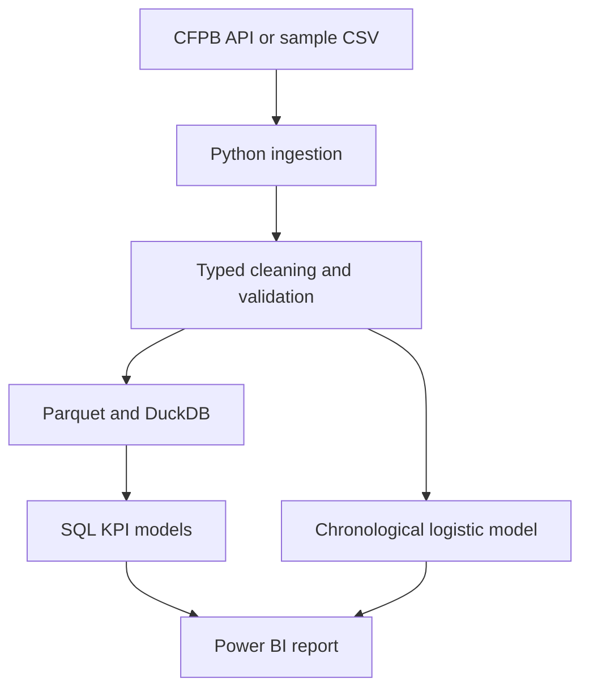

# Architecture and design decisions

## Decisions

- **DuckDB locally:** zero-service setup makes the repository reproducible for reviewers. The same normalized tables and SQL can be moved to PostgreSQL; do that upgrade before listing PostgreSQL on the resume.
- **Parquet:** preserves types and is compact compared with CSV.
- **Chronological split:** avoids using future complaints to evaluate a model trained on later data.
- **Interpretable logistic regression:** appropriate for explaining associations. It does not prove company quality or causality.
- **Complaint volume caution:** companies differ in customer base, products, and reporting exposure. Raw counts must not be presented as a fair quality ranking.

