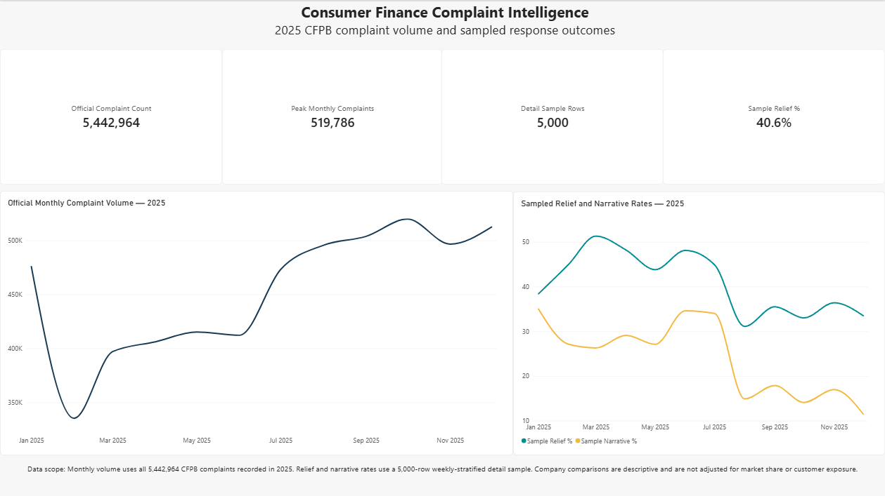
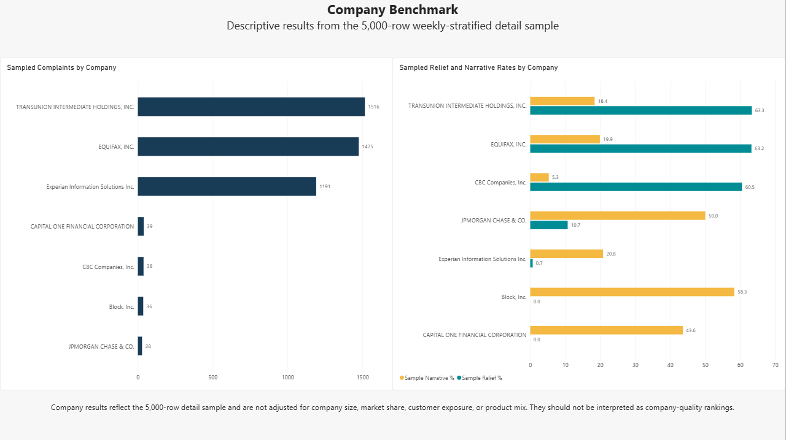
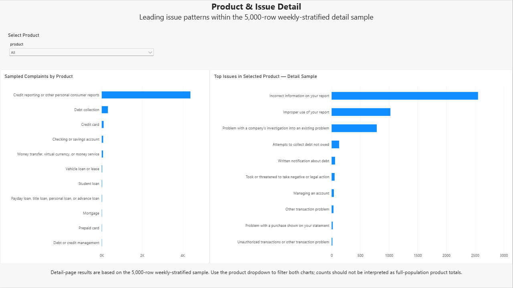

# Power BI report

The report presents the analytical outputs generated by `src.pipeline` in three pages. It distinguishes official full-population monthly totals from metrics calculated on the weekly-stratified detail sample.

## Data model

| Dataset | Role |
|---|---|
| `official_monthly_counts.csv` | Full-population 2025 complaint trend |
| `monthly_kpis.csv` | Detail-sample monthly metrics |
| `company_benchmark.csv` | Descriptive company comparisons |
| `product_issue_detail.csv` | Product and issue rankings |
| `model_metrics.csv` | Classifier evaluation metrics |

## Report pages

### Executive Overview



- KPI cards for official 2025 complaint volume, sampled relief rate, and sampled timely-response rate
- Monthly line chart using the official population series
- Sampled product and response-outcome breakdowns
- Notes that identify which values are population metrics and which are sample metrics

### Company Benchmark



- Company-level complaint counts within the detail sample
- Relief and narrative-availability comparisons
- Interactive company filtering
- Context note preventing unadjusted complaint counts from being interpreted as quality rankings

### Product & Issue Detail



- Product slicer
- Ranked issue counts
- Within-product issue shares
- Detail table for targeted investigation

## Analytical safeguards

- Full-population complaint totals are sourced only from the CFPB trends endpoint.
- Company, product, and relief breakdowns are labeled as detail-sample results.
- Company comparisons are descriptive and are not normalized for company size, market share, customer exposure, or product mix.
- The report does not treat missing consumer-dispute values as negative responses.

## Refresh

Run the pipeline before refreshing the report:

```powershell
python -m src.pipeline --limit 5000 --start-date 2025-01-01 --end-date 2025-12-31
```

Then refresh the Power BI model from the generated files in `artifacts/`.
